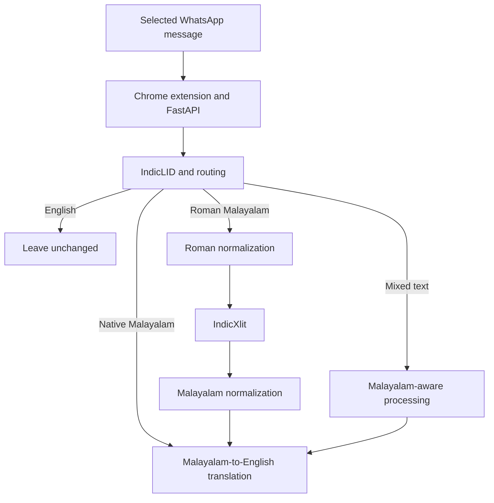

# Malayalam WhatsApp Translator

An open-source Chrome extension designed to help users understand Malayalam messages on WhatsApp Web by detecting Malayalam text and translating it into English.

> Development status: the extension/API foundation and model experiments are in place, but end-to-end Malayalam-to-English translation is not connected. The current `/translate` endpoint returns `language: "unknown"` and `translation: null`.

## Project Overview

The project focuses on Malayalam messages written in:

- Native Malayalam script
- Romanized Malayalam (Manglish)
- Mixed Malayalam-English WhatsApp messages

The core workflow is:

**Select or detect message → Identify Malayalam → Translate Malayalam to English → Show English meaning**

English messages should remain unchanged.

> This project is not an AI summarizer or chatbot. The primary goal is Malayalam language identification and Malayalam-to-English translation.

## Problem

Users who do not understand Malayalam may receive Malayalam or Roman Malayalam messages in WhatsApp chats.

Native Malayalam script can be difficult to understand, while Roman Malayalam is harder for conventional language identification systems because it uses Latin characters and often contains English words.

## Proposed Solution

A Chrome extension for WhatsApp Web will detect Malayalam text and provide an English meaning without changing normal English messages.

Example Roman Malayalam messages:

```text
Athrem onnum venda
Enikku manasilayi
Ningal evideya
Njan innu busy aanu
```

## Development Tools

Development and model experiments use the following tools. IndicTrans2 integration is planned; the model runtimes are not installed by the CI dependency manifests.

| Tool / Technology | Purpose | Official Link |
|---|---|---|
| Python 3.11 | Backend/API contract CI | [Python](https://www.python.org/downloads/) |
| Git | Version control | https://git-scm.com/ |
| Google Chrome | Chrome extension testing | https://www.google.com/chrome/ |
| Visual Studio Code | Development environment | https://code.visualstudio.com/ |
| FastAPI | Backend API framework | https://fastapi.tiangolo.com/ |
| Uvicorn | ASGI server for FastAPI | https://www.uvicorn.org/ |
| AI4Bharat IndicLID | Indian language identification | https://github.com/AI4Bharat/IndicLID |
| AI4Bharat IndicXlit | Indic transliteration | https://github.com/AI4Bharat/IndicXlit |
| AI4Bharat IndicTrans2 | Planned Malayalam-to-English translation | [IndicTrans2](https://github.com/AI4Bharat/IndicTrans2) |

### Recommended Environment

- Python 3.11 for backend/contract checks; Python 3.13 for static notebook CI
- Separate environments for legacy IndicLID/IndicXlit experiments; CI Python versions do not establish model-runtime compatibility
- Google Chrome
- Git
- Visual Studio Code
- macOS / Windows / Linux

## Project Status

Snapshot: 13 September 2026. [PR #3](https://github.com/sakethalladaaa/malayalam-whatsapp-translator/pull/3) and [PR #4](https://github.com/sakethalladaaa/malayalam-whatsapp-translator/pull/4) are open and have not been merged into `main`. The Phase 8 files and automation described below are on PR #4's `feat/phase8-indiclid-contract` branch.

| Phase | Scope | Status |
|---|---|---|
| Phase 0 | Git repository and project setup | Complete |
| Phase 1 | Backend foundation | Foundation complete; further API validation in PR #3 |
| Phase 2 | Chrome extension popup UI | Foundation complete |
| Phase 3 | Extension-to-FastAPI communication | Foundation complete; error-handling improvements in PR #3 |
| Phase 4 | WhatsApp Web DOM integration | Foundation complete; selection/viewport fixes in PR #3 |
| Phase 5 | IndicLID evaluation and Malayalam routing | Evaluation complete; `candidate_v1` frozen |
| Phase 6 | IndicXlit transliteration evaluation | Evaluation complete; not a production translation pipeline |
| Phase 7 | Roman-input and Malayalam-output normalization | Experiments complete; regression hardening in PR #3 |
| Phase 8 | Original IndicLID runtime reproduction and backend integration | In progress; adapter contract, notebook work and CI in PR #4 |

### Phase 5: frozen routing evidence

The documented `candidate_v1` routes Malayalam-family text when IndicLID predicts `mal_Mlym` or `mal_Latn`, or when the frozen Roman Malayalam lexical fallback fires. The fallback requires at least one marker for up to four words, and at least two for longer messages.

Historical results on the frozen 100-sample evaluation:

| Accuracy | Precision | Recall | F1 | English false positives |
|---:|---:|---:|---:|---:|
| 97.00% | 100.00% | 96.00% | 97.96% | 0/25 |

These are recorded evaluation results, not a fresh validation of the current backend. Do not retune the policy or reuse evaluated holdouts for tuning. See the [Phase 5 report](phase5/evaluation/README.md).

### Phases 6-7: transliteration and preprocessing

IndicXlit was evaluated for Roman Malayalam to Malayalam-script transliteration. Raw transliteration alone does not resolve informal spellings, lexical ambiguity or mixed-language chat. See the [Phase 6 failure analysis](phase6/evaluation/FAILURE_ANALYSIS.md).

[Phase 7 preprocessing](phase7/preprocessing.py) has two layers:

- Roman input normalization before transliteration: `nale → naale`, `ariyamo → ariyaamo`, `inu → innu`.
- Conservative Malayalam surface-form normalization after transliteration, including `ഇന്നു → ഇന്ന്` and `വിളിക്കം → വിളിക്കാം`.

The retained Roman-input candidate improved exact match from 43.33% to 46.67% on its 30-sample holdout, with two improvements and no observed regressions. This is limited project evidence, not semantic translation accuracy. See the [Phase 7 result and evaluation restrictions](phase7/evaluation/EXPERIMENT_2_RESULT.md).

### Phase 8: completed pieces and remaining work

Implemented in PR #4:

- [IndicLID adapter boundary](backend/app/lid.py): defines `LIDResult`, rejects empty input and raises `IndicLIDUnavailableError` for an unconfigured runtime. It does not yet load or run a model.
- [Routing contract](backend/app/router.py): exposes `malayalam_native`, `roman_malayalam`, `mixed` and `english` categories, with adapter/router unit tests.
- [Colab notebook](Phase8_IndicLID_Fix.ipynb): pins an upstream IndicLID commit, patches legacy BERT inference, checks weight-transfer mismatches and records batch/direct-BERT smoke-test outputs.
- Four GitHub Actions workflows and a Dependabot configuration, detailed below.

The Phase 8 Roman marker inventory is a conservative reconstruction, not the recovered Phase 5 implementation. Its additional script-based routing is not proof of equivalence to the frozen policy; the Phase 5 metrics must not be attributed to this reconstruction.

The notebook's saved outputs show native Malayalam, Roman Malayalam, English and Latin-script mixed-language examples. They do not establish a fresh, repeatable Colab setup. Before backend integration, the remaining review items are:

1. Explicitly pin compatible runtime dependencies and document any restart requirements.
2. Make checkout/download paths absolute and reruns safe, with setup failures stopping execution.
3. Assert batch output count and input order, and add a genuine Malayalam-plus-English mixed-script example.
4. Save fresh-runtime and repeated-run evidence.

After that, implement real model loading/prediction in the adapter, connect FastAPI, and validate routing, preprocessing, transliteration and translation together. Follow [issue #2](https://github.com/sakethalladaaa/malayalam-whatsapp-translator/issues/2) and the [runtime review follow-ups](https://github.com/sakethalladaaa/malayalam-whatsapp-translator/pull/4#issuecomment-5655435624).

## Target Architecture

This is the intended processing flow, not an already connected production pipeline.



## Bots, CI and Security Checks

Dependabot is an update bot; the other entries are automated checks run by GitHub Actions. Their configurations are in PR #4, not yet on `main` at this snapshot.

| Integration | What it checks or does | How it helps |
|---|---|---|
| Phase 8 contract tests | Compiles backend Python and runs the 13 adapter/router tests on Python 3.11 | Catches syntax errors and regressions in the tested contract |
| Notebook validation | Checks tracked notebook schema, Python/shell-cell syntax and saved execution errors; tests the validator on Python 3.13 | Catches structurally broken notebooks without running model code |
| actionlint | Validates workflow YAML, expressions and supported shell checks within Phase 8 CI | Catches workflow mistakes before they affect CI |
| CodeQL | Analyzes Python and JavaScript/TypeScript source; uploads code-scanning results | Helps reviewers find potential security issues in source code |
| Ruff | Runs `ruff check` over `backend`, `phase6`, `phase7` and `scripts` | Catches Python lint problems; no separate formatter check is configured |
| pip-audit | Audits `requirements-ci.txt` and notebook-validation dependencies, including resolved dependencies | Reports known package vulnerabilities; not a source-code or model audit |
| Dependabot | Configured for grouped weekly GitHub Actions and pip-manifest update PRs in `/` and `/.github` | Reduces manual dependency-update work; does not automatically merge fixes |

### Workflow files and triggers

| Workflow | Configured triggers |
|---|---|
| [Phase 8 CI](.github/workflows/phase8.yml) | PRs targeting `main`, pushes to `main`, manual |
| [Python Quality / Ruff](.github/workflows/ruff.yml) | PRs targeting `main`, pushes to `main`, manual |
| [CodeQL](.github/workflows/codeql.yml) | PRs targeting `main`, pushes to `main`, weekly, manual |
| [Python Dependency Audit](.github/workflows/dependency-audit.yml) | PRs targeting `main`, pushes to `main`, weekly, manual |

Scheduled runs and manual-dispatch availability require the workflows on the default branch. See [GitHub's trigger documentation](https://docs.github.com/en/actions/reference/workflows-and-actions/events-that-trigger-workflows).

[Dependabot configuration](.github/dependabot.yml) has a limit of five open version-update PRs per update entry. Its default-branch activation remains pending merge; configuration in a PR is not evidence that update PRs have run. See [Dependabot setup](https://docs.github.com/en/code-security/how-tos/secure-your-supply-chain/secure-your-dependencies/configure-version-updates).

The broader backend/API, Phase 7 and extension syntax workflow is separate work in [PR #3](https://github.com/sakethalladaaa/malayalam-whatsapp-translator/pull/3); it is not part of the Phase 8 workflow.

### What green checks do not prove

- Notebook validation does not execute cells, download models or prove fresh Colab reproducibility.
- Contract tests do not exercise real IndicLID inference, translation quality or the frozen Phase 5 evaluation.
- A successful audit means no known vulnerabilities were reported for the dependencies resolved at that time, not that the project is vulnerability-free.
- Adding workflows does not automatically make them required merge checks; repository rules must be configured separately.

See [CI validation details](docs/CI.md) for the notebook validator's scope.

### Verified CI snapshot

All four workflows passed for commit [`671f20c`](https://github.com/sakethalladaaa/malayalam-whatsapp-translator/commit/671f20c98258d2cd9e81ee7b1c610ff9f4c5dd4a):

- [Phase 8 CI](https://github.com/sakethalladaaa/malayalam-whatsapp-translator/actions/runs/34782555670)
- [Python Quality](https://github.com/sakethalladaaa/malayalam-whatsapp-translator/actions/runs/34782555612)
- [CodeQL](https://github.com/sakethalladaaa/malayalam-whatsapp-translator/actions/runs/34782555512)
- [Python Dependency Audit](https://github.com/sakethalladaaa/malayalam-whatsapp-translator/actions/runs/34782555620)

The local backend/test and notebook-manifest audits also reported no known vulnerabilities, as recorded in the [PR validation comment](https://github.com/sakethalladaaa/malayalam-whatsapp-translator/pull/4#issuecomment-5656134448). Check the [Actions page](https://github.com/sakethalladaaa/malayalam-whatsapp-translator/actions) for newer results.

## Local Validation

From the repository root, use an activated Python 3.11 test environment, separate from legacy model environments. The commands below install test/audit tools only, not IndicLID, IndicXlit or IndicTrans2.

```bash
python -m pip install -r requirements-ci.txt -r .github/requirements-notebook-ci.txt -r .github/requirements-audit.txt
python -m compileall -q backend
PYTEST_DISABLE_PLUGIN_AUTOLOAD=1 python -m pytest backend/tests phase7/tests scripts/tests -q
python scripts/check_notebooks.py
python -m pip_audit -r requirements-ci.txt
python -m pip_audit -r .github/requirements-notebook-ci.txt
```

Optional local lint and extension syntax checks (Node.js required for the latter):

```bash
python -m pip install ruff==0.16.7
python -m ruff check backend phase6 phase7 scripts
node --check extension/src/content.js
```

`requirements-ci.txt` pins the direct API/test dependencies; it is not a full transitive lockfile or a model-runtime manifest. The Phase 8 contract job currently installs pytest directly, while the audit reads this manifest. Notebook tooling and the audit tool are pinned separately in `.github/requirements-notebook-ci.txt` and `.github/requirements-audit.txt`.

## Not Yet Integrated

- DCO sign-off check: contributor sign-off policy and rollout remain pending; no DCO check is enabled.
- SonarQube Cloud: project/account integration and analysis configuration remain pending; no Sonar quality gate is enabled.
- Real IndicLID backend loading, IndicTrans2 translation and end-to-end API/model validation remain pending.

Keep evaluation datasets and the frozen Phase 5 policy unchanged while completing the runtime work. Passing CI is not a substitute for the outstanding Colab and end-to-end validation.
